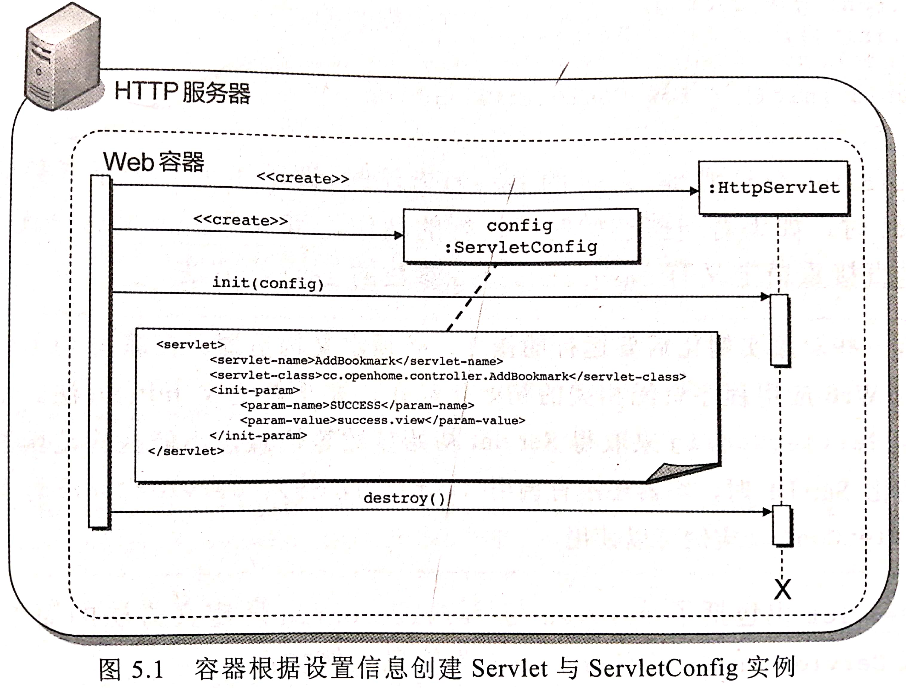

## 生命周期  
- **`ServletConfig`类**：对于每个Servlet的设置信息，Web容器会生成一个`ServletConfig`作为代表对象。  
- **`GenericeServlet`类**：同时实现`Servlet`和`ServletConfig`。  
    - **封装`ServletConfig`**：主要目的是将初始`Servlet`调用`init(ServletConfig)`方法传入的`ServletConfig`封装起来。  
    - **无参`init()`方法**：通过重新定义无参`init()`方法，就可以在初始化时添加一些自定义操作。  
    - **日志`log`方法**：还添加了`log`方法运行日志，不过日志功能非常简单，一般使用功能更强大的日志API。  
- **创建`Servlet`的流程**：这个过程只在创建`Servlet`实例后发生一次。 
    1. 读取`Servlet`设置信息，同时将`Servlet`类加载并实例化。
    2. 根据设置信息产生`ServlectConfig`对象。  
    3. 调用`Servlet`接口的`init(ServletConfig)`方法，将产生的`ServlectConfig`对象当作参数传入。  
    4. 调用无参`init()`方法，该方法用于被重新定义以便在初始化时添加操作。  
> 当有一些对象实例化后要运行的操作，必须定义构造器。  
> 在编写Servlet时，若想要运行与Web应用程序资源相关的初始化动作，要重新定义init()方法。  
> 例如要使用ServletConfig获取Servlet初始化参数，则不能在构造器中定义，
> 因为实例化Servlet时，容器还没有调用init(ServletConfig)方法传入ServletConfig, 构造器函数并没有ServletConfig实例可用。  



**API**: 
```java
public interface Servlet{
    void init(ServletConfig config);
    ServletConfig getServletConfig();
    String getServletInfo();
    void service(ServletRequest request, ServletResponse response);
    void destroy();
}
public interface ServletConfig{
    String getServletName();
    ServletContext getServletContext();
    String getInitParameter(String name);
    Enumeration<String> getInitParameterNames();
}
public class GenericServlet implements Servlet, ServletConfig{
    private ServletConfig config;

    public GenericServlet(){}
    //继承Servlet的方法
    @Override
    public void init(ServletConfig config){
        this.config = config;
        this.init();
    }
    @Override
    public ServletConfig getServletConfig(){}
    @Override
    public String getServletInfo(){}
    @Override
    public void service(ServletRequest request, ServletResponse response){}
    @Override
    public void destroy(){}
    //继承ServletConfig的方法
    @Override
    public String getServletName(){}
    @Override 
    public ServletContext getServletContext(){}
    @Override
    public String getInitParameter(String name){}
    @Override
    public Enumeration<String> getInitParameterNames(){}
    //通过重写init()，就可初始化时候添加初始化操作。  
    public abstract void init();
    //日志操作
    public void log(String message){}
    public void log(String message, Throwable throwable){}

}
```

### 使用`ServletConfig`

**设置Servlet初始化参数**：可以在标注或web.xml中设置初始参数。  
- `@WebServlet`注解的`initParams`属性：用`@WebInitParam(name="", value="")`设置初始化参数的名称和值。  
- `<servlet>`元素的`<init-parame>`子元素：`<param-name>`和`<param-value>`一次设置初始化参数的名称和值。 

**Servlet初始化参数**：  
- **常数作用**：Servlet初始化参数通过作为常数设置。  
- **常数的默认值**：可以将一些Servlet程序默认值使用标注设为初始化参数。  
- **变更常数值**：之后若想变更哪些信息，可以创建web.xml进行设置，以覆盖标注设置。
    > 就不需要变更源代码，重新编译、部署的操作。 
    > servlet name 必须相同，否则无法覆盖设置。因为容器是通过servlet name来确定servlet。 
    > 若没有设置servlet name,则默认为类完整名称。  
                                                  
**标注设置Servlet初始化参数**： 
```java
@WebServlet(
        name = "ServletInitParameter",
        urlPatterns = "/life/servlet_init_parameter",
        loadOnStartup = -1,
        initParams = {
                @WebInitParam(name = "姓名", value = "钟景文"),
                @WebInitParam(name = "方式", value = "注解"),
                @WebInitParam(name = "作用", value = "默认常数")
        }
)
public class ServletInitParameter extends HttpServlet {
    @Override
    protected void doGet(HttpServletRequest request, HttpServletResponse response)
            throws ServletException, IOException {
        request.setCharacterEncoding("UTF-8");
        response.setContentType("text/html; charset=UTF-8");
        PrintWriter writer = response.getWriter();

        ServletConfig config = this.getServletConfig();
        String name = config.getInitParameter("姓名");
        String way = config.getInitParameter("方式");
        String function = config.getInitParameter("作用");

        writer.println("姓名 = " + name + "<br>");
        writer.println("方式 = " + way + "<br>");
        writer.println("作用 = " + function + "<br>");
    }
}
```
**web.xml设置Servlet初始化参数**：
```xml
<web-app>
    <servlet>
        <servlet-name>ServletInitParameter</servlet-name>
        <servlet-class>pers.mortal.learn.servlet.life.ServletConfigExamplepers.mortal.learn.servlet.life.ServletConfigExample</servlet-class>
        <init-param>
          <param-name>姓名</param-name>
          <param-value>钟景文</param-value>
        </init-param>
        <init-param>
          <param-name>方式</param-name>
          <param-value>XML</param-value>
        </init-param>
        <init-param>
          <param-name>作用</param-name>
          <param-value>覆盖默认常数，便于更替常数</param-value>
        </init-param>
      </servlet>
      <servlet-mapping>
        <servlet-name>ServletInitParameter</servlet-name>
        <url-pattern>/life/servlet_init_parameter</url-pattern>
      </servlet-mapping>
</web-app>
```

### 使用`ServletContext`  
- **`ServletContext`接口**：定义了运行Servlet应用程序环境的一些行为与观点，  
 - 取得所请求资源的URI：可以使用ServletContext实现对象取得所请求资源的URI、  
 - 设置与储存属性、  
 - 应用程序初始化参数，  
 - 甚至动态设置Servlet实例。  
 
**`SevletContext`初始化参数**： 
- 使用`web.mxl`配置`ServletContext`初始化参数： 
> 当整个Web应用程序加载Web容器之后，容器就会生成一个ServletContext对象，作为整个应用程序的代表。  
> 并设置给ServletConfig。
> 每个Web应用程序都有一个相对应的`ServletContext`，针对“应用程序”初始化需要用到的一些参数，
> 可以在`web.xml`中设置应用程序初始化参数，结合`ServletContextListener`来做。 

**API**：
```java
public interface ServletContext{
    //路径指定必须以"/"开头，这个斜杠代表应用程序环境根目录。
    //（以"/"称为环境相对路径，没有"/"开头的成为请求相对路径，HttpServletRequest的getRequestDispatcher()方法会将请求相对路径转换为环境相对路径再调用ServletContext的getRequestDispatcher()方法）。 
    RequestDispatcher getRequestDispatcher(String url);     
    
    //路径指定必须以"/"开头，表示相对于应用程序环境根目录。
    // 返回Web应用程序中某个目录中有哪些文件，目录信息以"/"结尾，文件信息不以"/"结尾。  
    Set<String> getResourcePaths(String path);     
    
    //路径指定必须以"/"开头，表示相对于应用程序环境根目录，或者相对是/WEB-INF/lib中JAR文件里/META-INF/resources的路径。 
    //返回InputStream实例，读取文件内容
    IntputStream getResourceAsStream(String path);
}
```

**示例**：
```java
@WebServlet(
        name = "ServletContextExample",
        urlPatterns = "/life/servlet_context_example",
        loadOnStartup = -1,
        initParams = {
                @WebInitParam(name = "path", value = "/")
        }
)
public class ServletContextExample extends HttpServlet {
    @Override
    protected void doGet(HttpServletRequest request, HttpServletResponse response)
            throws ServletException, IOException {
        request.setCharacterEncoding("UTF-8");
        response.setContentType("text/html; charset=UTF-8");
        OutputStream outputStream = response.getOutputStream();

        String path = Optional.ofNullable(request.getParameter("path")).orElse("/");
        String load = Optional.ofNullable(request.getParameter("load")).orElse("/advance/创建Servlet的流程.jpg");
        ServletContext context = this.getServletContext();

        Set<String> paths = context.getResourcePaths(path);
        InputStream inputStream = context.getResourceAsStream(load);

        paths.stream().forEach(i -> {
            try {
                outputStream.write((i + "<br>").getBytes());
            } catch (IOException e) {
                e.printStackTrace();
            }
        });

        while(inputStream.available() > 0) {
            outputStream.write(inputStream.read());
        }
    }
}
```

### `PushBuilder`服务器推送  
```java
public interface HttpServletRequest extends ServletRequest{
    PushBuilder newPushBuilder();   //获取PushBuilder实例，用于进行服务器推送。需要服务器和浏览器都支持HTTP2.0，否则返回null。 
}
public interface PushBuilder{
    PushBuilder path(String path);  //添加资源的路径。
    PushBuilder addHeader(String header, String value); //为资源添加标头。
    push(); //推送资源。
}
```

**`PushBuilder`服务器推送实例**：
```java
@WebServlet(
        name = "PushBuilderExample",
        urlPatterns = "/life/push_builder_example",
        loadOnStartup = -1,
        initParams = {
                @WebInitParam(name = "path", value = "/")
        }
)
public class PushBuilderExample extends HttpServlet {
    @Override
    protected void doGet(HttpServletRequest request, HttpServletResponse response)
            throws ServletException, IOException {
        request.setCharacterEncoding("UTF-8");
        response.setContentType("text/html; charset=UTF-8");
        //服务器推送
        String load = Optional.ofNullable(request.getParameter("load")).orElse("/advance/创建Servlet的流程.jpg");
        Optional.ofNullable(request.newPushBuilder())
                .ifPresent(pushBuilder -> pushBuilder.path(load).addHeader("Content-Type", "image/jpg").push());
    }
}
```

**Tomcat9.0启用HTTP2.0支持**：
- 必须在加密联机中进行，
- 在`server.xml`中设定`Connector`。 
> 1.找到如下`<Connector>`标注
> 2.去除<Connector>批注，
> 3.设定好凭证信息。
> 4.重新启动tomcat,就可以用支持HTTP2.0的浏览器。 
> 如果Server的控制台中显示没有ARP/native链接库，那是因为Java执行环境的java.library.path中找不到链接库，
> 解决方式之一是将tomcat文件夹的bin/tcnative-l.dll复制至正在使用的JDK的bin文件夹。
```xml
<Server>
    <!--省略上面的配置-->

    <!-- Define an SSL/TLS HTTP/1.1 Connector on port 8443 with HTTP/2
         This connector uses the APR/native implementation which always uses
         OpenSSL for TLS.
         Either JSSE or OpenSSL style configuration may be used. OpenSSL style
         configuration is used below.
    -->
    <!--
    <Connector port="8443" protocol="org.apache.coyote.http11.Http11AprProtocol"
               maxThreads="150" SSLEnabled="true" >
        <UpgradeProtocol className="org.apache.coyote.http2.Http2Protocol" />
        <SSLHostConfig>
            <Certificate certificateKeyFile="conf/localhost-rsa-key.pem"
                         certificateFile="conf/localhost-rsa-cert.pem"
                         certificateChainFile="conf/localhost-rsa-chain.pem"
                         type="RSA" />
        </SSLHostConfig>
    </Connector>
    -->

    <!--省略下面的配置-->
</Server>
```