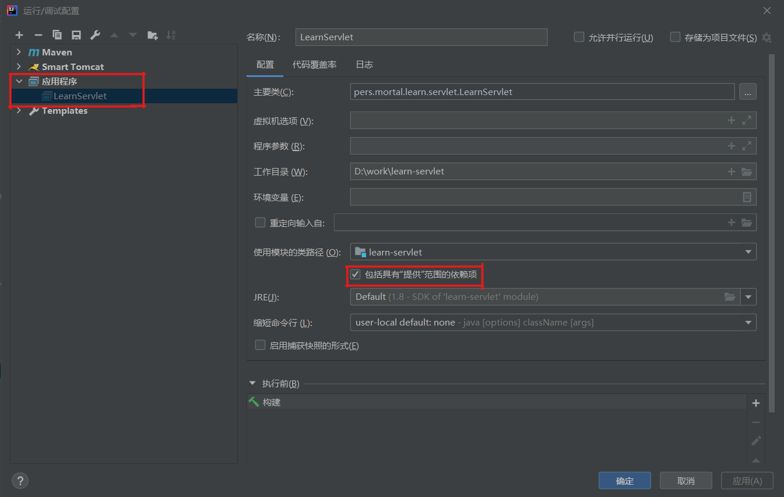
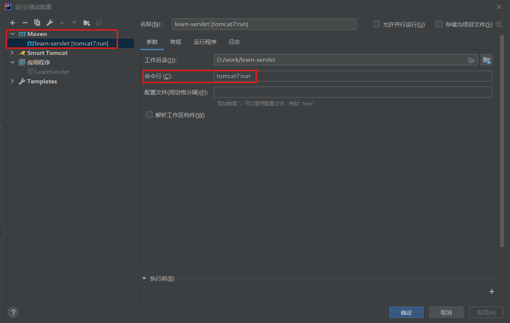

## 配置  

### 开发环境配置  
- `Web`容器：Servlet对象“生存”于web容器，由Web容器创建，初始化，管理，销毁Servlet对象。  
- 开发时`tomcat`： 为了便于开发，专注于代码。不能每次运行Servlet程序都要重新部署一次，需要配置IDE使其快捷的运行Servlet程序。  
> Apache tomcat 是开源免费的Web容器，附带一个简单的Http服务器。 
> Servlet与Web容器的关系就像是java与虚拟机的关系，Web容器与Http服务器的关系就像JVM与操作系统的关系。  
> 运行Servlet程序需要先打包成War， 然后放入到tomcat目录下的webapps文件夹下。  
> 这样做不利于开发， 故开发的时候

IDEA的maven依赖项目注意事项：
- `provide`作用域：IDEA 需要在“运行/调试”配置中 勾选“包括具有提供范围的依赖项目”， `provided`才能有效。 

添加`Servlet`依赖： 
> 编译的时候，并没有Web容器，会因为无法导入Servlet导致编译错误。  
> 所以需要添加Servlet依赖，以便通过编译检查。 
> 注意： 嵌入时tomcat已经包含Servlet,故无需重复引入Servlet。  
```xml
<dependencise>
 <dependency>
      <groupId>javax.servlet</groupId>
      <artifactId>javax.servlet-api</artifactId>
      <version>4.0.0</version>
      <scope>provided</scope>
    </dependency>
    <dependency>
      <groupId>javax.servlet.jsp</groupId>
      <artifactId>jsp-api</artifactId>
      <version>2.2</version>
      <scope>provided</scope>
    </dependency>
</dependencise>
```

#### 嵌入式tomcat(提供时)  
**tomcat的启动流程**：  
- 启动JVM并执行Tomcat的main()方法。  
- 加载war并初始化Servlet。  
- 正常服务。  
> 启动Tomcat无非就是设置好classpath并执行Tomcat某个jar包的main()方法，  
> 我们完全可以把Tomcat的jar包全部引入进来，然后自己编写一个main()方法，先启动Tomcat，然后让它加载我们的webapp就行。
> Tomcat实际上也是一个Java程序，我们看看Tomcat的启动流程。

> 。    
```xml
<!--maven依赖项-->
<dependencies>
    <dependency>
        <groupId>org.apache.tomcat.embed</groupId>
        <artifactId>tomcat-embed-core</artifactId>
        <version>${tomcat.version}</version>
        <scope>provided</scope>
    </dependency>
    <dependency>
        <groupId>org.apache.tomcat.embed</groupId>
        <artifactId>tomcat-embed-jasper</artifactId>
        <version>${tomcat.version}</version>
        <scope>provided</scope>
    </dependency>
</dependencies>
```
```java
public class LearnServlet{
    public static void main(String[] args) throws LifecycleException {
        System.out.println(new File("src/main/webapp").getAbsolutePath());
        // 启动Tomcat:
        Tomcat tomcat = new Tomcat();
        tomcat.setPort(Integer.getInteger("port", 8080));
        tomcat.getConnector();
        // 创建webapp:
        Context ctx = tomcat.addWebapp("/contextPath_internal-tomcat", new File("src/main/webapp").getAbsolutePath());
        WebResourceRoot resources = new StandardRoot(ctx);
        resources.addPreResources(
                new DirResourceSet(resources, "/WEB-INF/classes",
                        new File("target/classes").getAbsolutePath(), "/"));
        ctx.setResources(resources);
        tomcat.start();
        tomcat.getServer().await();
    }
}
```


#### maven-tomcat插件  
>只有tomcat7 无法运行Servlet4.0新增方法。  
```xml
<!--maven插件-->
<plugins>
    <plugin>
        <groupId>org.apache.tomcat.maven</groupId>
        <artifactId>tomcat7-maven-plugin</artifactId>
        <version>2.2</version>
        <configuration>
        <uriEncoding>UTF-8</uriEncoding>
        <path>/contextPath_tomcat-maven-plugin</path>
        <port>8080</port>
        </configuration>
    </plugin>
</plugins>
``` 


#### IDEA插件——连接本地tomcat  
>必须在本地安装由tomcat，且IDEA社区版只能使用smart tomcat插件。  


### Servlet结构  
```java
//通用协议的 Servlet,ServletRequest, ServletResponse 
package javax.servlet;
public interface Servlet{//管理生命周期，提供服务。
    void init(ServletConfig config);
    ServletConfig getServletConfig();

    void service(ServletRequest request, ServletResponse response);
    String getServletInfo();

    void destroy();
}
public interface ServletRequest{
}
public interface ServletResponse{
}
public interface ServletConfig{
}
```
```java
//实现Servlet,ServletConfig, 保留service方法给具体协议servlet来实现。  
package javax.servlet;
public class GenericServlet implements Servlet, ServletConfig{
    public void init(ServletConfig config){}
    public ServletConfig getServletConfig(){}
    public abstract void service(ServletRequest request, ServletResponse response);
    public String getServletInfo(){}
    public void destroy(){}
}
```
```java
//处理Http协议的抽象Servlet实现。  
package javax.servlet.http;
public interface HttpServletRequest extends ServletRequest{
}
public interface HttpServletResponse extends ServletResponse{
}
public class HttpServlet extends GenericServlet{
    public HttpServlet();
    //调用HTTP服务
    public void service(ServletRequest request, ServletResponse response){
       service((HttpServletRequest)request, (HttpServletResponse)response);
    }
    //提供HTTP服务
    protected void service(HttpServletRequest request, HttpServletResponse response)
        throws ServletException, IOException{
        String method = request.getMethod();
        if(method.equals(METHOD_GET)){
            doGet(request, response);
        }else if(method.equals(METHOD_HEAD)){ 
            doHead(request, response);
        }else if(method.equals(METHOD_POST)){
            doPost(request, response);
        }else if(method.equals(METHOD_PUT)){
            doPut(request, response);
        }else if(method.equals(METHOD_DELETE)){
            doDelete(request, response);
        }else if(method.equals(METHOD_OPTIONS)){
            doOptions(request, response);
        }else if(method.equals(METHOD_TRACE)){
            doTrace(request, response);
        }
    }
    protected long getLastModified(HttpServletRequest request){}
    //Http方法  
    protected void doGet(HttpServletRequest request, HttpServletResponse response){}
    protected void doHead(HttpServletRequest request, HttpServletResponse response){}
    protected void doPost(HttpServletRequest request, HttpServletResponse response){}
    protected void doPut(HttpServletRequest request, HttpServletResponse response){}
    protected void doDelete(HttpServletRequest request, HttpServletResponse response){}
    protected void doOptions(HttpServletRequest request, HttpServletResponse response){}
    protected void doTrace(HttpServletRequest request, HttpServletResponse response){}
}
```

### Servlet配置  
**配置Servlet有两种方法**：  
- 注解配置： JavaEE6 的 Servlet3.0之后才有的功能。  
- XML配置： 旧版本中时候XML文件定义Servlet信息。  
    - **`web.xml`**: 定义web应用程序的Servlet（/WEB-INF/classes中的类）。   
    - **`web-fragment.xml`**: 与`web.xml`类似，只不过定义的是JAR文件中的Servlet。  

#### `@WebServlet`注解配置  
- **`@WebServlet`**：类注解，标记类为Servlet类，类需继承`HttpServlet`。  
    - **`name`**属性（字符串值）： Servlet名，默认值为类的完全限定名。  
    - **`urlPatterns`**属性（字符串值）: Servlet路径的URL模式。若请求URL的Servlet路径符合该模式，则由该Servlet类处理。  
    - **`loadOnStratup`**属性（整型数字）: 设置大于0的值，默认值-1。定义Servlet初始化的顺序。  
> 应用程序去启动的时候，并没有创建所有Servlet示例。  
> 容器会在首次接到请求需要某个Servlet服务时，才将对应的Servlet类实例化，初始化操作，再处理请求。  
> `loadOnStartup`设置Servlet在应用程序启动时就加载类，实例化，初始化。  
> 数字代表了Servlet的初始化顺序，从小到大。  
> 若多个Servlet初始化数字相同，则由容器实现产商自行决定要如何载入哪个Servlet.  
```java
@WebServlet(
    name = "hello",
    urlPatterns = "/hello",
    loadOnStartup = 1
)
public class HelloServlet extends HttpServlet {
    protected void doGet(HttpServletRequest req, HttpServletResponse resp) throws ServletException, IOException {
        resp.setContentType("text/html");
        String name = req.getParameter("name");
        if (name == null) {
            name = "world";
        }
        PrintWriter pw = resp.getWriter();
        pw.write("<h1>Hello, " + name + "!</h1>");
        pw.flush();
    }
}
``` 

#### `web.xml`XML配置  
- **`<display-name>`**: 定义Web应用程序的名称（不是Web应用程序环境根目录）。  
- **`<welcome-file-list>`**和**`<welcom-file>`**：**定义欢迎页面**。若请求路径下没有相应文件，则把请求路径下的欢迎页面作为默认页面返回。  
- **`<default-context-path>`**： Servlet4.0以后，作为**默认环境路径**。 考虑到既有容器的兼容性，容器可能会不理会这个设定。  
- **`<servlet>`和`<servlet-mapping>`**：**定义Servlet**。  
    - `<servlet>`：**定义Servlet的**。 
        - **`<servlet-name>`**: 定义Servlet名。  
        - **`<servlet-class>`**: Servlet实现类的完全限定名。 
        - **`<load-on-startup>`**: 启动Web应用时就初始化Servlet的初始化顺序。 
    - `<servlet-mapping>`: 定义Servlet路径。    
        - **`<servlet-name>`**: 通过Servlet名映射到`<servlet>`元素。  
        - **`<url-ptterns>`**：定义Servlet路径的URL模式。  
        
**`web.xml`**声明：  
```xml
<!DOCTYPE web-app PUBLIC
 "-//Sun Microsystems, Inc.//DTD Web Application 2.3//EN"
 "http://java.sun.com/dtd/web-app_2_3.dtd" >
<web-app>
<!--...配置Servlet-->
</web-app>
```
```xml
<?xml version="1.0" encoding="UTF-8" ?>
<web-app
    xmlns:xsi="http://www.w3.org/2001/XMLSchema-instance"
    xmlns="http://xmlns.jcp.org/xml/ns/javaee"
    xsi:schemaLocation=
        "http://xmlns.jcp.org/xml/ns/javaee
        http://xmlns.jcp.org/xml/ns/javaee/web-app_4_0.xsd"
    version="4.0"
>
<!--...配置Servlet-->
</web-app>
```

**XML配置**： 
```xml
<?xml version="1.0" encoding="UTF-8" ?>
<web-app
    xmlns:xsi="http://www.w3.org/2001/XMLSchema-instance"
    xmlns="http://xmlns.jcp.org/xml/ns/javaee"
    xsi:schemaLocation=
        "http://xmlns.jcp.org/xml/ns/javaee
        http://xmlns.jcp.org/xml/ns/javaee/web-app_4_0.xsd"
    version="4.0"
>
    
</web-app>
```

#### 配置说明  
- **配置覆盖**：`web.xml`配置会**覆盖**`@WebServlet`配置中相同的内容。  
- **逻辑URI**: 无论`web.xml`还是`@WebServlet`，浏览器请求的URI只是**逻辑上的名称**。  

### URI模式  
- **请求URI**格式：`"contextPath" + "servletPath" + "pathInfo"`。  
    - `contextPath`：应用**程序环境根**路径。Web容器根据`contextPath`选择处理请求URI的**Web应用程序**（一个容器可能会有部署多个Web应用程序）。 
        - `""`：空字符串标识应用程序环境根路径与**Web网站环境根**路径相同（在tomcat的webapps目录下命名为ROOT）。  
        - 以`/`开头，不以`/`结尾：普通的应用程序环境根路径（在tomcat的webapps目录下的一个WAR文件名，或解压缩后的目录名）。  
    - `servletPath`：Servlet路径。 Web容器根据`servletPath`选择具体处理请求URI的**Servlet实例**。  
    - `pathInfo`：匹配URL模式，。 

**URI模式**：
> `<...>`表示不含`/`的字符串,做占位符以便说明。    
- `/<...>/*`：路径映射（PATH mapping），请求URI除去环境路径的部分若以`/<...>/`作为开头，都会交由该Servlet处理。  
- `*.<...>`：扩展映射（EXTENSION mapping），请求URI除去环境路径的部分若以`*.<...>`作为结尾，都会交由该Servlet处理。  
- `""`：环境根目录映射（CONTEXT ROOT），对应至环境根目录，也就是`/`的请求。  
- `/`：预设Servlet，当找不到合适的URI模式对应时，就会使用预设Servlet。  
- **完全匹配**：不符合以上设置的其他字符串，都要做路径的严格对应。  

**URI模式优先规则**：  
>如果URI模式设置比对规则在某些URI请求上有所重叠，比对原则时从最严格的URI模式开始符合。  
1. 完全匹配。 
2. 路径映射。 
3. 扩展映射。 

**Servlet路径**：  
 - servletPath：是指Servlet路径，不包括路径信息与请求参数。  
 - 对应URI模式：Servlet路径直接对应至URI模式。  
 - Servlet路径格式：基本上是以`/`开头（`""`和`/*`的Servlet路径是`""`空串）。  
 
 **路径信息**： 
 - pathInfo：路径信息不包括请求参数，指除去除去环境路径和Servlet路径后的额外路径信息。  
 - `null`值：没有额外路径信息返回null值。  
 - `/<...>`：以`/`开头的字符串。  
 
 **获取URI信息**： 
 ```java
package javax.servlet.http;
public class HttpServletRequest extends ServletRequest{
    public String getRequestURI(){}
    public String getContextPath(){}
    public String getServletPath(){}
    public String getPathInfo(){}
}
```

#### httpServletMapping  
- **`getHttpServletMappint()`**：Servlet4.0， `HttpServletRequest`新增`getHttpServletMapping()`方法，可以取得`HttpServletMapping` 对象  
- **`javax.servlet.http.HttpServletMapping`**：该对象能在执行时期，侦测执行中的Servlet是通过哪个URI对应过来，以及被比对到的值为何等信息。  
```java
public class HttpServletMappingExample extends HttpServlet{
    public void doGet(HttpServletRequest request, HttpServletResponse response){
        HttpServletMapping mapping = request.getHttpServletMapping();
        String match = mapping.getMappingMatch();//返回匹配的模式（类别）：CONTEXT_ROOT,DEFAULT,EXACT,EXTENSION,PATH。
        String value = mapping.getMatchValue();  //返回对比值。是指匹配时用来对比的值，而不是指Servlet路径。  
        String pattern = mapping.getPattern();   //返回对比时的URI模式。
    }
}
```

### Web文件夹结构  
**Web容器要求应用程序部署目录结构**：  
- 应用程序根目录 
    - `WEB-INF`文件夹：封闭的资源，浏览器**无法直接请求**这些资源。 需要请求转发或使用专门的方法才能获取资源。  
        - `web.xml`部署描述文件：  
        - `lib`文件夹：放置应用程序用到的JAR文件。   
        - `classes`文件夹：  
    - 其他文件或文件夹：公开的资源。根目录下的资源可以直接下载，浏览器可以直接请求的资源。 
> IDE 管理项目会有其专属的文件组织，但那并不是真正上传至Web容器之后该有的架构。  
> Web容器要求应用程序部署满足上述结构。  
> 实际部署的时候，会将应用程序封装成一个WAR文件（ZIP压缩格式）。  

**Web应用程序项目成分**：  
- 静态资源（HTML，图片，声音，影片等）  
- Servlet  
- JSP  
- 自定义类  
- 工具类  
- 部署描述文件（web.xml等），设置信息（Annotation等）  

**`/WEB-INF/lib`下JAR文件**:
- 资源：JAR文件可以放置Servlet,JSP,自定义类，工具类，部署描述文件等，应用程序的类加载可以从JAR文件中载入对应资源。  
- **`/META-INF/resources`**文件夹：JAR文件的`/META-INF/resources`文件可以放置**静态资源和JSP**。  

**资源搜索规则**：  
- 静态资源：先搜索Web根目录下的资源，若无，再搜索`/WEB-INF/lib`下的JAR文件的`/META-INF/resources`目录下的资源。  
- 类： 先搜索`/WEB-INF/classes`， 若无，再收缩`/WEB-INF/lib`下的JAR文件中的类。  

**获取`/WEB-INF`中的资源**：  
- 浏览器不可直接请求：浏览器不可以直接请求`/WEB-INF`中的资源。  
- 程序控制请求：但是可以通过**程序的控制**取得`/WEB-INF`中的资源。  
```
ServletContext.getResource()
ServletContext.getResourceAsStream()
RequestDispathcer请求调派 
```

**请求URI结尾`/`的处理**：  
- 以`/`结尾：表示请求（Web应用程序根目录下的）文件夹。  
    - 若文件夹存在：
        - 若有欢迎页面：将会传回该文件夹下的欢迎页面。  
        - 若无欢迎页面：尝试指JAR文件的`/META-INF/resources`中寻找已放置的资源页面。  
    - 若文件夹不存在：使用默认Servlet。  

### `web-fragment.xml`文件   

**读取JAR文件中Servlet可被容器读取**： 
> Servlet3.0 以后，可以使用注解来设置Servlet的相关信息。  
> 实际上如果JAR文件中有使用注解的Servlet，Web容器也可以读取注解信息，载入类并注册为Servlet进行服务。  

**JAR文件可作为Web容器的部分模块**：  
> Servlet3.0 以后， JAR文件可用来作为Web应用程序的部分模块。 
> 事实上，不仅是Servlet,监听器、过滤器等也可以在编写、定义注解完毕后，封装在JAR文件中。  
> 视需要放置至Web应用程序的/WEB-INF/lib中，弹性抽换Web应用程序的功能组件。  

**JAR文件的部署描述文件`web-fragment.xml`**：  
> 在JAR文件中，处理可以使用注解定义Servlet，监听器，过滤器外，
> 也可以拥有自己的部署描述文件，避免了过去常有的一堆设定都得写在web.xml中，造成难以分工合作。  

**`web-fragment.xml`声明**：  
> 注意： 根元素是`<web-fragment>`，不是`<web-app>`。  
```xml
<?xml version="1.0" encoding="UTF-8" ?>
<web-fragment id="WebFragment_ID" version="4.0"
  xmlns="http://xmlns.jcp.org/xml/ns/javaee"
  xmlns:xsi="http://www.w3.org/2001/XMLSchema-instance"
  xsi:schemaLocation="
  http://xmlns.jcp.org/xml/ns/javaee 
  http://xmlns.jcp.org/xml/ns/javaee/web-fragment_4_4.xsd">

    <display-name> WebFragment1 </display-name>
    <name>WebFragment1</name><!--比web.xml多出这个元素, 少一个元素（default-context-path）-->
   
</web-fragment>
```

**`web.xml`与`web-fragment.xml`**：  
- 可以决定`web.xml`与`web-fragment.xml`的配置顺序。 有两种方法：
    - 在`web.xml`中使用`<absolute-ordering>`定义顺序。  
        - `<name>`：指定`web-fragment.xml`配置名。  
    - 在`web-fragment.xml`中各自使用`<ordering>`定义顺序。
        - `<before>`：优先于子元素指定的`web-fragment.xml`配置。  
        - `<after>`：落后于子元素指定的`web-fragment.xml`配置。  
            - `<others/>`：表示其他`web-fragment.xml`。  
            - `<name>`：指定名字的`web-fragment.xml`。  
            
```xml
<?xml version="1.0" encoding="UTF-8" ?>
<!--web.xml中使用<absolute-ordering>-->
<web-app
    xmlns:xsi="http://www.w3.org/2001/XMLSchema-instance"
    xmlns="http://xmlns.jcp.org/xml/ns/javaee"
    xsi:schemaLocation=
        "http://xmlns.jcp.org/xml/ns/javaee
        http://xmlns.jcp.org/xml/ns/javaee/web-app_4_0.xsd"
    version="4.0"
>
    <absolute-ordering>
        <name>WebFragment1</name>
        <name>WebFragment2</name>
    </absolute-ordering>
</web-app>
```
```xml
<?xml version="1.0" encoding="UTF-8" ?>
<web-fragment id="WebFragment_ID" version="4.0"
  xmlns="http://xmlns.jcp.org/xml/ns/javaee"
  xmlns:xsi="http://www.w3.org/2001/XMLSchema-instance"
  xsi:schemaLocation="
  http://xmlns.jcp.org/xml/ns/javaee 
  http://xmlns.jcp.org/xml/ns/javaee/web-fragment_4_4.xsd"
>
    <display-name> WebFragment1 </display-name>
    <name>WebFragment1</name>
    <ordering>
        <after>
            <name>WebFragment2</name>    
        </after>
    </ordering>
</web-fragment>
```
```xml
<?xml version="1.0" encoding="UTF-8" ?>
<web-fragment id="WebFragment_ID" version="4.0"
  xmlns="http://xmlns.jcp.org/xml/ns/javaee"
  xmlns:xsi="http://www.w3.org/2001/XMLSchema-instance"
  xsi:schemaLocation="
  http://xmlns.jcp.org/xml/ns/javaee 
  http://xmlns.jcp.org/xml/ns/javaee/web-fragment_4_4.xsd"
>
    <display-name> WebFragment2 </display-name>
    <name>WebFragment1</name>
</web-fragment>
```
```xml
<?xml version="1.0" encoding="UTF-8" ?>
<web-fragment id="WebFragment_ID" version="4.0"
  xmlns="http://xmlns.jcp.org/xml/ns/javaee"
  xmlns:xsi="http://www.w3.org/2001/XMLSchema-instance"
  xsi:schemaLocation="
  http://xmlns.jcp.org/xml/ns/javaee 
  http://xmlns.jcp.org/xml/ns/javaee/web-fragment_4_4.xsd"
>
    <display-name> WebFragment3 </display-name>
    <name>WebFragment3</name>
    <ordering>
        <before>
           <others/> 
        </before>
    </ordering>
</web-fragment>
```

### `metadata-complete`属性  

**`web.xml`的`<web-app>`的`metadata-complete`属性**：   
> `web.xml`的`<web-app>`的`metadata-complete`**属性设置为true**，  
> 表示`web.xml`中已完成Web应用程序的相关定义，  
> 部署是就不会扫描标注web-fragment.xml中的定义。  
> 如果有`<absolute-ordeing>`与`<ordering>`也会被忽略。  

**`web-fragment.xml`的`<web-fragment>`的`metadata-complete`属性**：   
> 如果Web-fragment.xml中指定的类可在Web应用程序的`/WEB-INF/classes`中找到，就会使用该类。  
> 注意：如果该类本身有标注，而web-fragment.xml又定义该类为Servlet，此时会有两个Servlet实例。  
> 如果将`web-fragment.xml`的`<web-fragment>`的`metadata-complete`属性设置为`true`，  
> 就只会处理自己JAR文件中标注信息。  