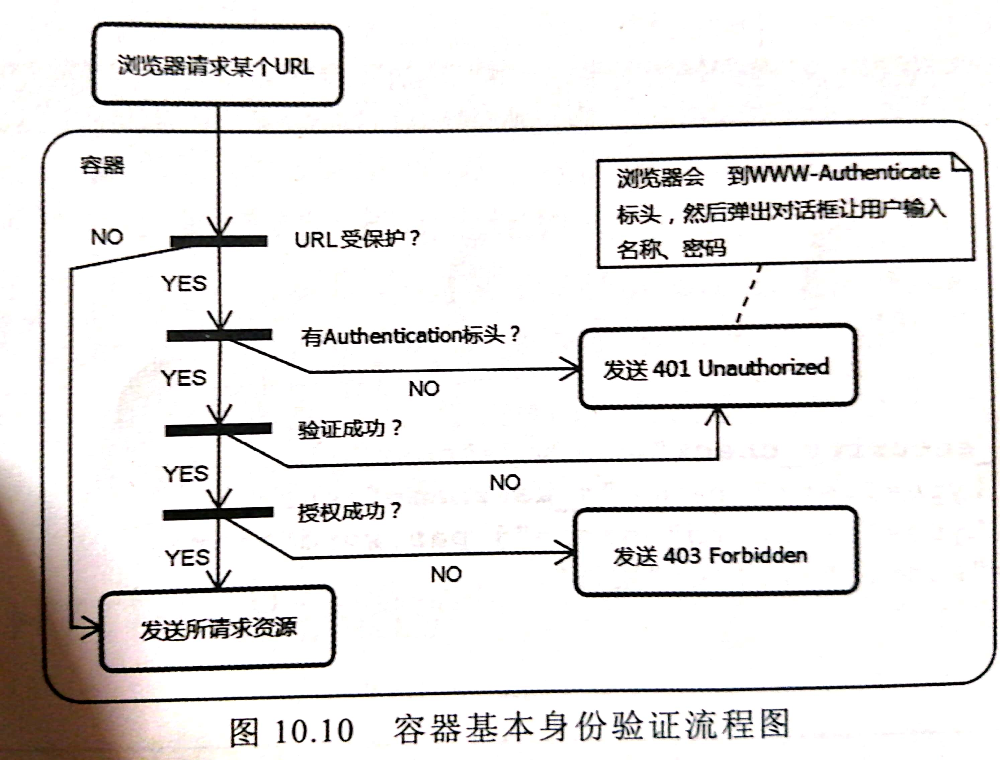
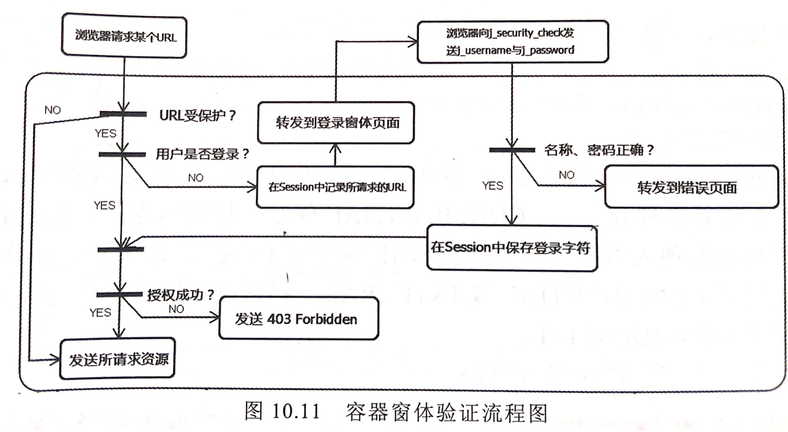

## Web容器安全管理  

**Web容器可以提供以下四种基本安全特性的保证**： 
- 验证(Authentication):
- 资源访问控制(Access control for resources):
- 数据完整性(Data Integrity):
- 数据机密性(Confidentiality or Dat Privacy):

> 在JavaEE中，容器提供了上述四种需求的实现，这些实现JavaEE的标准，只要是符合JavaEE规范的容器就可以使用这些实现。  
> JavaEE 使用基于角色的访问控制(Role-based access control)。  
> 使用Web容器提供的安全实现需要了解以下JavaEE名词与概念。  

**JavaEE名词与概念**：  
- 用户：允许使用应用程序服务的合法个体（人或机器）。  
- 用户组：将多个用户定义在一个组内，可以方便管理。通常一个用户可以同时属于多个组。  
- 角色：Java应用程序许可证管理的依据。 组是系统上管理用户的方式，角色是Java应用程序中管理授权的方式。  
- Realm:储存身份验证所需数据的地方。  
> Java应用程序无法直接使用服务器系统上的用户或组来进行许可证管理，而必须根据角色来定义（开发时不应该考虑到应用部署哪个具体的服务器，故无法实现知道都有什么用户以及组）。  
> 当Java应用程序实际部署时，再通过服务器特定的设置方式，将角色对应至用户或组。 

**Tomcat容器中设置用户/角色对应**：  
> 通过conf文件夹下的tomcat-users.xml文件来设置用户和角色的对应。  
```xml
<tomcat-users>
    <role rolename="admin"/>
    <role rolename="member"/>
    <user username="zhongjingwen" password="123456789" roles="admin,member"/>
    <user username="zhongdongxiao" password="987654321" roles="member"/>
</tomcat-users>
```

**Web容器安全管理的方式**：  
- **声明安全**：在配置文件中声明哪些资源时只有合法的用户才可以访问，在不修改应用程序源代码的情况下，就为应用程序加上安全管理机制。  
- **编程安全**：在程序代码的编写逻辑中根据不同权限的用户，给予不同的操作功能。  
> 如果使用Web容器安全管理，可以使用`request`对象的`isUserInRole()`或`getUserPrincipal()`等方法判断用户是否属于某个角色或取得代表用户的`Principal`。  
> 然后进行相关逻辑判断，针对不同用户显示不同的功能。  

### 声明式安全  

**需要实现**：  
- 身份验证的方式。
- 授予访问页面的权限。  
- 定义用户。  

#### 基本`Basic`验证   
**在`web.xml`声明安全**：  
```xml
<web-app>
    <!--定义身份验证方式-->
    <login-config>
        <auth-method>BASIC</auth-method>
    </login-config>
    <!--授予指定访问角色权限，首先定义角色-->
    <security-role>
        <description>Admin User</description>
        <role-name>admin</role-name>
        <!--没有定义HTTP方法，则无论时哪个HTTP方法都只能被admin角色反问-->
    </security-role>
    <security-role>
        <description>Manager User</description>
        <role-name>manager</role-name>
    </security-role>
    <!--授予指定访问角色权限，然后授予访问权限-->
    <security-constraint>
        <!--定义访问控制资源，以URI和HTTP方法标识资源-->
        <web-resource-collection>
            <web-resource-name>Admin</web-resource-name>
            <url-pattern>/admin/*</url-pattern>
        </web-resource-collection>
        <!--定义访问控制权限-->
        <auth-contraint>
            <role-name>admin</role-name>
        </auth-contraint>
    </security-constraint>
    <security-constraint>
        <!--定义访问控制资源，以URI和HTTP方法标识资源-->
        <web-resource-collection>
            <web-resource-name>Manager</web-resource-name>
            <url-pattern>/manager/*</url-pattern>
            <!--表明除了GET、POST这两个HTTP方法，其他HTTP方法无论是否具备admin或manager角色都可以访问-->
            <http-method>GET</http-method>
            <http-method>POST</http-method>  
            <!--表明除了GET、POST这两个HTTP方法， 其他方法都收到约束-->         
            <http-method-omission>GET</http-method-omission>
            <http-method-omission>POST</http-method-omission>
        </web-resource-collection>
        <!--定义访问控制权限-->
        <auth-constraint>
            <role-name>admin</role-name>
            <role-name>manager</role-name>
        </auth-constraint>
    </security-constraint>
    <!-- <auth-constraint/>空元素表示没有任何角色可以访问-->
    <!-- <role-name>**<role-name>表示任一通过验证的角色-->
    <deny-uncovered-http-methods/><!--Servlet3.1中， 表示拒绝未列入<security-constraint>的HTTP方法，试图访问将会返回302-->
</web-app>
```

##### 基本`Basic`验证原理  
- 初次请求，容器验证请求中是否含有`Authroization`标头，
    - 若没有，容器会响应`401 Unauthorized`的状态码和信息， 以及`WWW-Authenticate`标头给浏览器。  
    - 若有，则验证名称、密码是否正确，正确则将资源发送給浏览器。  
- 浏览器收到`WWW-Authenticate`标头
    - 弹出对话框，让用户输入名称、密码。  
    - 用户确认后，将名称、米娜以BASE64方式编码，  
    - 然后放在`Authroizaion`标头中送出。  
> 接下来在关闭浏览器之前，只要是对服务器的请求，每次都会包括`Authorization`标头，  
> 服务器每次也会检查是否有Authorization标头，所以登录有效期会一直持续到关闭浏览器。  



#### 声明式窗体验证  
> 如果需要自定义登录的页面，以及登录错误的页面，可以改用容器所提供等待窗体验证。 
> 只需要修改`<login-config>`设置。 
> 窗体发送的URI必须是`j_security_check`，名称的请求参数必须是`j_username`，密码的请求参数必须是`j_password`。 
```xml
<web-app>
    <login-config>
        <auth-method>FORM</auth-method>
        <form-login-config>
            <form-login-page>/security/login.html</form-login-page>    
            <form-error-page>/security/error.html</form-error-page>
        </form-login-config>
    </login-config>
</web-app>
```
```html
<!DOCTYPE html>
<html>
    <head>
        <meta charset="UTF-8"/>
        <title>登录</title>
    </head>
    <body>
        <form action="../j_security_check" method="post">
            名称：<input type="text" name="j_username"/><br>
            密码：<input type="text" name="j_password"/><br>
            <input type="submit" value="发送"/>
        </form>
    </body>
</html>
```
```html
<!DOCTYPE html>
<html>
<head>
    <meta charset="UTF-8"/>
    <title>登录失败</title>
</head>
    <body>
        登录失败。
    </body>
</html>
```
    
##### 声明式窗体验证原理  
- 检验登录状态：当使用窗体验证时，如果要访问的受保护的资源，容器会检验用户有无登录。  
- `javax.security.subject`属性：检查`HttpSession`中有无此属性，若没有表示没有验证，转发至登录页面。  
- 登录后：容器会在`HttpSession`设置属性名称`javax.security.auth.subject`的对应指`javax.security.auth.Subject`实力。  
- 注销：用户是否登录是通过`HttpSession`的`javax.security.auth.subject`属性判断，故`HttpSession`的`invalidate()`方法可以设计成注销机制。  



#### 其他声明式验证  
> 处理基本身份验证与窗体验证外，在`<auth_method>`还可以设置`DIGEST`或`CLIENT_CERT`。  

**`DIGEST`**：  
> 即**摘要验证**，是基本身份验证的变种，也是通过`Authorization`传送名称、密码。 
> 浏览器会直接传送名称，密码则先进行(MD5)摘要演算(非加密)再发送。  
> 服务器根据名称从后端取得密码，以同样的方式做摘要演算，再对比浏览器的摘要数据是否符合。  
> JavaEE规范并无要求一定得支持DIGEST。（看产商是否支持，Tomcat是支持的。）   
    
**`CLIENT-CERT`**: 
> 同样用对话框输入名称与密码， 
> 但是使用PKC进行加密，  
> 客户端需要安装证书。  

### 使用HTTPS保护数据  
> HTTPS中， 服务器会提供证书来证明身份以及加密公钥。 
> 要使用HTTPS，只要再web.xml中需要安全传输得`<security-contraint>`中设置。  
> 服务器必须支持SSL并安装证书，参考之前的设置。  
```xml
<web-app>
    <security-constraint>
        <web-resource-collection>
            <web-resource-name>Admin</web-resource-name>
            <url-pattern>/admin/*</url-pattern>
        </web-resource-collection>
        <auth-constraint>
            <role-name>admin</role-name>
        </auth-constraint>
        <!--设置数据机密,HTTPS传输-->
        <user-data-constraint>
<!--            <transport-guarantee>NONE</transport-guarantee>&lt;!&ndash;默认值&ndash;&gt;-->
            <!-- CONFIDENTIAL和INTEGRAL都保证机密性和完整性，惯例上都设置`CONFIDENTIAL`-->
            <transport-guarantee>CONFIDENTIAL</transport-guarantee><!-- 保证机密性-->
<!--            <transport-guarantee>INTEGRAL</transport-guarantee>&lt;!&ndash; 保证完整性 &ndash;&gt;-->
        </user-data-constraint>
    </security-constraint>
</web-app>
```

### 编程式安全  
> web容器的声明式安全仅能针对URI来设置哪些资源必须受到保护。  
> 如果打算依据不同角色在同一个页面设置可存取不同的资源，显然无法单纯使用声明式安全管理来实现。 
> 在Servlet3.0中， `HttpServletRequest`新增三个与安全有关的方法：  
- `authenticate()`:  **搭配先前声明式`web.xml`的设置**，在程序逻辑设计上，只用通过容器验证的用户才可以观看。  
- `login()`:  
- `logout()`:

**API**:  
```java
public interface HttpServletRequest{
    //如果authenticate()结果是false，表示用户未登录，在service()完成后，会自动转发至登录窗体。 
    //在登录窗体可以决定登录验证时的action、请求参数等。 
    boolean authenticate(HttpServletResponse response);    
    //执行登录时，可以使用请求对象的login()方法。
    //如果登录成功，SessionID会更换。
    void login(String username, Stirng password);
    //注销登录。 
    void logout();

}
```

**示例**：  
```xml
<web-app>
  <login-config>
      <auth-method>FORM</auth-method>
      <form-login-config>
        <form-login-page>/security/plogin.html</form-login-page>
        <form-error-page>/security/error.html</form-error-page>
      </form-login-config>
    </login-config>
</web-app>
```
```java

@WebServlet(
        name = "user",
        urlPatterns = "/security/user",
        loadOnStartup = -1
)
public class User extends HttpServlet {

    @Override
    public void doGet(HttpServletRequest request, HttpServletResponse response)
            throws ServletException, IOException {
        if(request.authenticate(response)){//如果authenticate()结果是false，表示用户未登录，在service()完成后，会自动转发至登录窗体(login.html)。
            response.setContentType("text/html; charset=UTF-8");
            PrintWriter writer = response.getWriter();
            writer.println("必须验证用户才可以看到的资料");
            writer.println("<a href='logout'>注销</a>");
        }

    }
}
@WebServlet(
        name = "login",
        urlPatterns =  "/security/login",
        loadOnStartup = -1
)
public class Login extends HttpServlet {
    @Override
    public void doPost(HttpServletRequest request, HttpServletResponse response)
            throws ServletException, IOException{
        String user = request.getParameter("user");
        String passwd = request.getParameter("passwd");
        try{
            request.login(user, passwd);
            response.sendRedirect("user");
        }catch(ServletException e){
            response.sendRedirect("login.html");
        }
    }
}
@WebServlet(
        name = "logout",
        urlPatterns = "/security/logout",
        loadOnStartup = -1
)
public class Logout extends HttpServlet {
    @Override
    protected void doGet(HttpServletRequest request, HttpServletResponse response)
            throws ServletException, IOException{
        request.logout();
        response.sendRedirect("plogin.html");
    }
}
```
```html
<!DOCTYPE html>
<html>
    <head>
        <meta charset="UTF-8"/>
        <title>登录</title>
    </head>
    <body>
        <form action="login" method="post">
            名称：<input type="text" name="user"/><br>
            密码：<input type="password" name="passwd" autocomplete="off"/><br>
            <input type="submit" value="发送"/>
        </form>
    </body>
</html>
```

#### 标注访问控制  
> 除了在`web.xml`中设置`<security-constraint>`外，  
> 也可以直接在程序代码中使用`@ServletSecurity`设置对应的信息。  

```java
@WebServlet("/admin")//对应于url模式
@ServletSecurity(
    value = @HttpConstraint(rolesAllowed = {"admin"}),//对应于<auth-constraint>与所有HTTP方法。
    httpMethodConstraints = {                                   //对应于<http-method>/<auth-constraint>组合
        @HttpMethodConstraint(
            value = "GET", rolesAllowed = {"admin", "manager"},
            transportGuarantee = TransportGuarantee.CONFIDENTIAL  //设置<transport-guarantee>
            ),
        @HttpMethodConstraint(
            value = "POST", rolesAllowed = {"admin", "manager"},
            transportGuarantee = TransportGuarantee.CONFIDENTIAL
            )
    }
)
public class Manager extends HttpServlet{

}
```
