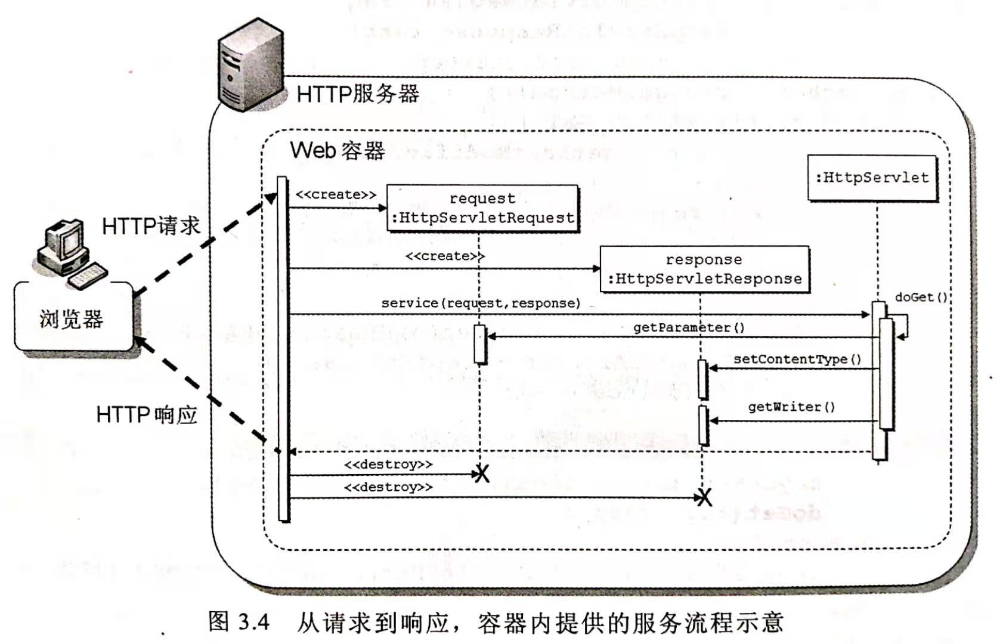
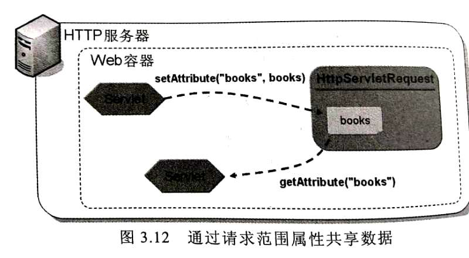

## HTTP服务  

### 容器与Servlet  
> 注意，Apache tomcat自带一个简单的HTTP服务器。  
> HttpServletRequest,HttpServletResponse实现类有容器提供。 

**Web容器工作机制**：  
>管理Servlet/JSP：Web容器是Servlet/JSP唯一认识的“HTTP服务器”。  
>
1. 请求到来：HTTP服务器转交请求get容器，容器创建`HttpServletRequest`代表当次请求，创建`HttpServletResponse`作为稍后响应的对象。  
2. 选择Servlet：容器根据`@WebServlet`标注或`web.xml`设置，找出处理该请求的`Servlet`对象。调用其`service()`方法，传入刚刚创建的`HttpServletRequest`、`HttpServletResponse`对象。  
3. doXXX方法：在`service()`方法中，根据HTTP方法调用对应的`doXXX()`方法。`doXXX()`方法自定义处理流程。  
4. 返回响应：刷新响应缓冲区后，容器将`HttpServletResponse`对象转换成HTTP响应报文，发送给HTTP服务器。  
5. 销毁对象：销毁本次请求周期创建的`HttpServletRequest`、`HttpServletResponse`对象。  

  

**`doXXX()`方法**：  
- `doGet()`     ：处理GET请求。  
- `doHead()`    ：处理HEAD请求。  
- `doPost()`    ：处理POST请求。  
- `doPut()`     ：处理PUT请求。  
- `doDelete()`  ：处理DELETE请求。  
- `doOption()`  ：处理OPTION请求。  
- `doTrace()`   ：处理TRACE请求。  
> 继承HttpServlet之后，需要实现与HTTP方法对应的doXXX()方法来处理请求。  
> 如果浏览器发送了没有实现的请求，就会返回错误信息给浏览器。  
```java
public class HttpServlet extends GenericServlet{
    public HttpServlet();
    //调用HTTP服务
    public void service(ServletRequest request, ServletResponse response)
            throws ServletException, IOException{
        HttpServletRequest  httpRequest;
        HttpServletResponse httpResponse;
       
        try{
            httpRequest  = (HttpServletRequest)  request;
            httpResponse = (HttpServletResponse) response;
        }catch(ClassCastException e){
            throw new ServletException("non-HTTP request or response");
        }
        service(httpRequest, httpResponse);//调用下面的方法。  
    }
    //提供HTTP服务
    protected void service(HttpServletRequest request, HttpServletResponse response)
        throws ServletException, IOException{
        String method = request.getMethod();
        if(method.equals(METHOD_GET)){
            long lastModified = getLastModified(request);
            if(lastModified == -1){
                doGet(request, response);
            }else{
                long ifModifiedSince;
                try{
                    ifModifiedSince = request.getDateHeader(HEADER_IFMODSINCE);
                }catch(IllegalArgumentException iae){
                    ifModifiedSince = -1;
                }
                if(ifModifiedSince < (lastModified / 1000 * 1000)){
                    maybeSetLastModified(response, lastModified);
                    doGet(request, response);
                }else{
                    response.setStatus(HttpServletResponse.SC_NOT_MODIFIED);
                }
            }
        }else if(method.equals(METHOD_HEAD)){ 
            long lastModified = getLastModified(request);
            maybeSetLastModified(response, lastModified);
            doHead(request, response);
        }else if(method.equals(METHOD_POST)){
            doPost(request, response);
        }else if(method.equals(METHOD_PUT)){
            doPut(request, response);
        }else if(method.equals(METHOD_DELETE)){
            doDelete(request, response);
        }else if(method.equals(METHOD_OPTIONS)){
            doOptions(request, response);
        }else if(method.equals(METHOD_TRACE)){
            doTrace(request, response);
        }
    }
    protected long getLastModified(HttpServletRequest request){}
    //Http方法  
    protected void doGet(HttpServletRequest request, HttpServletResponse response)
            throws ServletException, IOException{
        String protocol = request.getProtocol();
        String message = lStrings.getString("http.method_get_not_supported");
        if(protocol.endswith("1.1")){
           response.sendError(HttpServletResponse.SC_METHOD_NOT_ALLOWED, message);
        }else{
            response.sendError(HttpServletResponse.SC_BAD_REQUEST, message);
        }
    }
    protected void doHead(HttpServletRequest request, HttpServletResponse response){}
    protected void doPost(HttpServletRequest request, HttpServletResponse response){}
    protected void doPut(HttpServletRequest request, HttpServletResponse response){}
    protected void doDelete(HttpServletRequest request, HttpServletResponse response){}
    protected void doOptions(HttpServletRequest request, HttpServletResponse response){}
    protected void doTrace(HttpServletRequest request, HttpServletResponse response){}
}
```

### `HttpServletRequest`请求对象  
> `Enumeration`处理：
> 建议使用`List Collections.list(Enumeration<T> enumeration);`将`Enumeration`转换成`ArrayList`。  
> `Enumeration`是个JDK1.0的接口，与`Iterator`重叠，建议转换成`ArrayList`以便使用for语法、Lambada、StreamAPI。  
> 请求参数乱码：
> URI编码由HTTP服务器处理，Body编码由容器处理。  
> 当浏览器的字符编码与HTTP服务器或容器的字符编码不同时，就会造成非西欧预习字符的乱码现象。  
> 可以通过设置容器编码来解决Body编码乱码问题，至于URI乱码则需要手动转换编码。  

**`HttpServletRequest` API与使用**： 
```java
public interface HttpServletRequest extends ServletResponse{
    //处理请求参数
    String getParameter(String name);               //指定参数名，返回一个字符串值。
    String[] getParameterValues(String name);       //指定参数名，返回所有字符串值。
    Enumeration<String> getParameterNames();        //取得所有参数名。
    Map<String, String[]> getParameterMap();        //取得所有参数，Key是请求参数名，Value是请求参数值。
    //处理请求标头
    String getHeader(String name);                  //指定标头名，返回一个字符串值。
    Enumeration<String> getHeaders(String name);    //指定标头名，返回所有字符串值。
    Enumeration<String> getHeaderNames();           //取得所有标头名称。
    //请求参数编码处理  
    getCharacterEncoding();                         //获取Content-Type标头的字符编码信息，若无则返回null。  
    setCharacterEncoding(String charset);           //设置容器编码，只对POST产生作用（参数在Body），对GET无用（参数在URI上）。
    //读取内容，则一调用，否则抛出
    BufferReader getReader();                       //读取请求的Body数据。 
    ServletInputStream getInputStream();            //代表请求Body的串流对象。
    //读取文件，Servlet3.0新增方法，需先为HttpServlet实现类添加注解`@MultipartConfig`才能获取Part对象，否则返回null。
    Part getPart(String name);                      //指定名称才能取得对应的Part对象。
    Collection<Part> getParts();                    //处理多个上传文件。  
    //multipart/form-data发送的每个内容区段，都会有以下标头信息。
    //Content-Disposition: form-data; name="xxx" xxx="yyy"
    //Content-Type: mime-type
}
```
**`MultipartPartConfig`注解配置使用`Part`接口**：  
```java
public @interface MultipartPartConfig{
    int fileSizeThreshold() default 0;          //若上传文件超过设置门槛，会先写入缓存文件。
    String location()       default "";         //设置写入文件是的目录。若设置，缓存文件写到指定目录，也可搭配Part的write方法。 
    long maxFileSize()      default -1L;        //限制上传文件大小。默认值为-1L，表示不限制大小。
    long maxRequestSize()   default -1L;        //限制multipart/form-data请求个数。默认值为-1L，表示不限制大小。
    
}
```
**Servlet3.1的Part接口**: 
```java
public class Part{
    public String getHeader(){}         //获取内容标头：Content-Disposition、Content-Type
    public String getName(){}           //获取name。
    public void write(String filename); //将上传文件文件指定文件名写入磁盘，写入路径是相对于@MultipartConfig的location设置的路径。 
    //Servlet3.1 新增，可以取得上传文件名。但是各浏览器上传的文件名有差异，API没有规定如何处理这些差异。故尽量别用这个方法。 
    public String getSubmittedFileName(){
        //获取标头
        String header = this.getHeader("Content-Disposition");
        //获取文件名
        Pattern fileNameRegex = Pattern.compile("filename=\"(.*)\"");
        Matcher matcher = fileNameRegex.matcher(header);
        matcher.find();
        String filename = matcher.group(1);
        //取出目录路径。
        if(filename.contains("\\")){
            return filename.substring(filename.lastIndexOf("\\") + 1);
        }else{
            return filename;
        }
    }
}
```
**XML配置**:  
```xml
<web-app >
<!--省略配置-->

    <!--web.xml中设置全局请求参数处理编码-->
        <!--Servlet4.0开始，可以在web.xml添加下述元素，设定整个应用程序的请求参数编码，就不用每次请求都手动设置-->
    <request-character-encoding>UTF-8</request-character-encoding>
    
    <!--web.xml中设置`@MultipartConfig`信息-->
    <servlet>
        <servlet-name>Hello</servlet-name>
        <servlet-class>package.Hello</servlet-class>
        <multipart-config>
            <file-size-threshold>0</file-size-threshold>
            <location>""</location>
            <max-file-size>-1L</max-file-size>
            <max-request-size>-1L</max-request-size>
        </multipart-config>
    </servlet>
</web-app>
```

### `HttpServletResponse`响应对象    
- 响应确认前设置标头：所有标头设置必须在响应确认之前，响应确认之后的设置的标头会被容器忽略。  
- 缓冲区：容器可以（但非必要）对响应进行缓冲，通常默认进行缓冲。
- 响应确认的时机：
    - Servlet的`service()`方法关闭。  
    - 响应内容超过`HttpServletResponse`的`setContentLength()`所设置的长度。  
    - 调用了`sendRedirect()`方法。 
    - 调用了`sendError()`方法。
    - 调用了`AsyncContext`的`complete()`方法。
```java
package javax.servlet.http;
public interface HttpServletResponse implements ServletResponse, AutoCloseable, Wrapper{
    //状态码
    int SC_OK = 200;
    int SC_MOVED_PERMANENTLY = 301;
    int SC_SC_FOUND = 302;
    int SC_MOVED_TEMPORARILY  ;
    //设置状态码
    void setStatus(Int status);
    //设置响应标头
    void setHeader(String name, String value);  //设置标头名称与值
    void addHeader(Strnig name, String value);  //在同一个标头名称商附加值
    void setIntHeader(String name, int value);  //标头值是整数
    void addIntHeader(String name, int value);
    void setDateHeader(String name, Date date); //标头值是整数
    void addDateHeader(String name, Date date);
        //设置专用标头
    void setContentType(String mimeType);       //设置响应类型，必须设置响应类型
    void setContentLength(int length);          //设置响应长度
        //输出字符串与响应编码
    PrintWriter getWriter();            //获取写出器，写出字符串到响应
    void setLocale(Locale locale);      //设置地区信息，包括语系与编码信息(需在XML设置地区编码对应配置)。同时设置HTTP响应的Content-Language
    void setCharacterEncoding(String encoding); //设置响应的编码信息。  
    String getCharacterEncoding();              //获取响应的编码信息。
        //输出二进制字符
    ServletOutputStream getOutputStream();      //输出二进制字符。 
    //响应缓冲方法
    int getBufferSize();    //获取缓冲区大小，必须在调用getWriter()或getOutputStream()方法之前调用，否则抛出IllegalStateException  
    void setBufferSize();   //设置缓冲区大小。
    boolean isCommitted();  //判断是否确认响应。
    void reset();           //在响应确认前调用reset()，重置所有响应信息（包括标头）。在响应确认之后调用抛出IllegalStateException    
    void resetBuffer();     //在响应确认前调用reset()，重置所有响应内容（不包括标头）。在响应确认之后调用抛出IllegalStateException
    void flushBuffer();     //清除所有缓冲区中已设置的响应信息至浏览器。
    //重定向和错误编码
    void sendRedirect(String url);  //重定向，指定绝对URL或相对URL。（通过设置状态码302，以及设置Location来实现，故必须在响应确认之前调用，否则抛出IllegalStateException）
    void sendError(int status);     //发现错误，返回表示错误的状态码（由于利用了HTTP状态码，要求浏览器重定向网页，故必须在响应确认之前调用，否则抛出IllegalStateException）。
    void sendError(int status, String message); //自定义响应信息。
}
public interface HttpServletRequest extends ServletRequest{
    Locale getLocale();    //获取客户端可接受的语系。
}
public interface ServletContext{
    String getMimeType(String extension);   //根据XML配置，获取后缀对应的Mime类型。
}
```
**XML配置**：
```xml
<web-app>
    <!--设置默认的区域与编码对应，-->
    <!--此时若使用response.setLocale(locale)设置了地区信息后，字符编码就使用对应的编码-->
    <locale-encoding-mapping-list>
        <locale-encoding-mapping>
            <locale>zh_TW</locale>
            <encoding>UTF-8</encoding>
        </locale-encoding-mapping>
    </locale-encoding-mapping-list>
    <!--Servlet 4.0新增，设定整个应用程序使用的响应编码-->
    <response-character-encoding>UTF-8</response-character-encoding>
    <!--设置后缀与与MIME类型-->
    <mime-mapping>
        <extension>pdf</extension>    
        <mime-type>application/pdf</mime-type>
    </mime-mapping>
</web-app>
```
**示例**：  
```java
import javax.servlet.annotation.WebServlet;

@WebServlet(    
    name = "example",
    urlParttens = "/service/example",
    loadOnStarup = 1
)
public class ExampleServlet extends HttpServlet{
    protected void doGet(HttpServletRequest request, HttpServletResponse response){
        //手动重定向
        response.setStatus(HttpServletResponse.SC_MOVED_PERMANENTLY);
        response.setHeader("Location", "new_url");
        //输出字符串与响应编码
        PrintWriter writer = response.getWriter();
        //法一，设置地区信息。然后由根据XML的<locale-encoding-mapping-list>设置的地区编码信息使用对应编码
        response.setLocale(locale);
        //法二，直接设置响应编码
        response.setCharacterEncoding("UTF-8");
        //法三，设置内容类型的时候一并设置响应编码
        response.setContentType("text/html; charset=UTF-8");
    }
}
```


### `RequestDispatcher`调派请求  
> 在Web应用程序中，经常需要多个Servlet来完成需求。  
> 可以获取`RequestDsipatcher`示例来调派请求，使得多个Servlet共同完成请求的处理。  
**`RequestDispatcher`调派请求**:
- **`include()`**请求包含：将另一个`Servlet`的处理流程包含进来，即包含`RequestDispatcher`匹配的Servlet的相同HTTP方法的处理流程。  
- **`forward()`**请求转发：将请求转发个别的`Servlet`处理，即转发给`RequestDispatcher`匹配的Servlet的相同的HTTP方法来处理剩余内容。 
- 区别： 
    - 请求转发:由当前Servlet设置响应头(不能设置响应体)，下一个Servlet既可设置响应头也可设置响应体。
    - 请求包含:当前Servlet和下一个Servlet共同完成响应头和响应体。
```java
import javax.servlet.ServletRequest;
public interface RequestDispatcher{
    void include(ServletRequest request, ServletResponse response);
    void forward(ServletRequest request, ServletResponse response);
}
```
**获取`RequestDispacther`实例**：
- **使用相对URI**：调用方法获取`RequestDispatcher`时要指定**转发或包含的相对URI网址**，然后才能根据URI模式取得对应的`Servlet`。   
- **允许查询字符串**： 可以在**转发或包含的相对URI网址**中添加查询字符串，那么在被包含或转发的Servlet中就可以像普通调用的Servlet一样使用`getParameter(name)`取得请求参数。  

```java
@WebServlet(
    name = "request-dispatcher",
    urlPatterns = "/example/request/dispatcher",
    loadOnStartup = -1
)
public class Example extends HttpServlet{
    @Override
    public void doGet(HttpServletRequest request, HttpServletResponse response){
        //法一，通过HttpServletRequest实例的getRequestDispatcher()方法
        //调用时指定转发或包含的相对URI网址，也可以包括查询URI
        RequestDispatcher requestDispatcher = request.getRequestDispatcher("other");//即访问/example/request/other.
        //法二，通过ServletContext实例的getRequestDispatcher()或getNamedDispatcher()方法。
    }  
}
```

#### 请求包含  
**`include`**:  
- 包含操作流程：将另一个Servlet的操作流程包括至目前的的Servlet操作流程中。    
- 参数对象来源：必须分别传入`ServletRequest`和`SerletResponse`接口的对象。  
    - 来源`service()`：可以是`service()`传入的对象。  
    - 来自自定义：
    - 来自封装器：  
**被包含的Servlet**:  
- 忽略请求标头设置： 被包含的Servlet中任何对请求标头的设置都会被忽略。  
- 可以使用`getSession()`：可以使用`getSession()`取得`HttpSession`对象，这是**唯一的例外**。  
> HttpSession底层默认使用Cookie, 所以响应会加上Cookie请求标头。 
```java
@WebServlet("/some")
public class Some extends HttpServlet{
    @Override
    protected void doGet(HttpServletRequest request, HttpServletResponse response)
            throws ServletException, IOException{
        //...
        RequestDispatcher requestDispatcher = request.getRequestDispatcher("other");
        requestDispatcher.include(request, response);
    }
}
```

#### 请求转发  
**`forward()`**:  
- 转发请求处理： 表示将请求处理转发给别的Servlet。  
- 参数对象来源： 调用时同样传入请求与响应对象。  
**目前的Servlet**：
- 禁止响应确认： 若要调用`forward()`方法，**目前的Servlet不能有任何响应确认**。 
    - 忽略处理：若在目前的Servlet中通过响应对象设置了一些响应但未被确认，则所有响应设置会被忽略。 
    - 抛出异常：如果已经有响应且调用了`forward()`方法，则会抛出`IllegalStateException`。  
    
    
#### 请求范围属性  
- 参数共享限制字符串： 在`include()`或`forward()`时包括请求参数的做法，仅适用于传递字符串给另一个Servlet。  
- **请求范围属性**用来共享对象：将**共享对象设置给请求对象成为属性**（称为请求范围共享属性），就可以在Servlet之间共享对象。  
- 请求范围属性**作用域为请求周期**：请求对象仅在此次请求周期内有效，在请求/响应之后，请求对象就会销毁，故请求范围属性也小时了。  


**处理请求范围属性**：  
```java
public class HttpServletRequest extends ServletRequest{
    setAttribute(String name, Object attribute){}   //指定名字与对象设置属性。
    getAttribute(String name){}                     //指定名字取得属性。
    getAttributeNames(){}                           //取得所有属性名称。
    removeAttribute(){}                             //指定名字移除属性。 
}
```
**特殊的请求范围属性**： 
> 属性名称以`java.`或`javax.`开头名称通常保留给规格书中某些特定意义的属性。  
> 
> 请求包含或请求转发的request对象和response对象来自最前端的Servlet。 
> 所以在后续的Servlet中查询请求URI将查询到的时第一个Servlet的请求URI。 
> 
> 这些特殊的请求范围属性表示`include()`方法或`forward()`方法传入的请求URI。 
> 也就是说可以通过这些属性，获得执行这个Servlet时所匹配的请求URI，而不是一开始的请求URI。  
- `javax.servlet.include.request_uri`:
- `javax.servlet.include.context_path`:
- `javax.servlet.include.servlet_path`:
- `javax.servlet.include.path_info`:
- `javax.servlet.include.query_string`:
- `javax.servlet.include.mapping`:（Servlet4.0新增）
- `javax.servlet.forward.request_uri`:
- `javax.servlet.forward.context_path`:
- `javax.servlet.forward.servlet_path`:
- `javax.servlet.forward.path_info`:
- `javax.servlet.forward.query_string`:
- `javax.servlet.forward.mapping`:（Servlet4.0新增）
**`RequestDispatcher`表示特殊的请求范围属性的常数**：
- `RequestDispatcher.INCLUDE_REQUEST_URI`:
- `RequestDispatcher.INCLUDE_CONTEXT_PATH`:
- `RequestDispatcher.INCLUDE_SERVLET_PATH`:
- `RequestDispatcher.INCLUDE_PATH_INFO`:
- `RequestDispatcher.INCLUDE_QUERY_STRING`:
- `RequestDispatcher.INCLUDE_MAPPING`:（Servlet4.0新增）
- `RequestDispatcher.FORWARD_REQUEST_URI`:
- `RequestDispatcher.FORWARD_CONTEXT_PATH`:
- `RequestDispatcher.FORWARD_SERVLET_PATH`:
- `RequestDispatcher.FORWARD_PATH_INFO`:
- `RequestDispatcher.FORWARD_QUERY_STRING`:
- `RequestDispatcher.FORWARD_MAPPING`:（Servlet4.0新增）

