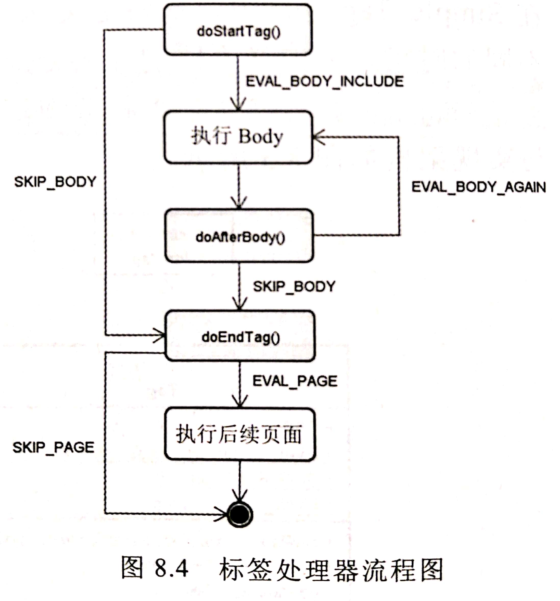

## 自定义标签  

### Tag File 
> tag指示元素指示容器如何处理Tag File。  
> attribute指示元素定义Tag File的属性。  
> Tag File只能放在/WEB-INF/tag或子文件夹中。   
> TagFile中可以使用out、config、request、response、session、application、jspContext等隐式对象。  
> JspContext是PageContext的子类。  
> TagFile转译为javax.servlet.jsp.tagext.SimpleTagSupport的子类。  
> TagFile在JSP，并不是静态包含或动态包含，  
> 若在TagFile中编写Scriptlet，其中的隐式对象其实是转移后的.java中的doTag()方法中的局部变量。  
> 在TagFile中的Scriptlet定义的局部变量，也是doTag()中的局部变量，不能与JSP中的Scriptlet沟通。  

```tag
<%@ tag description="显示错误信息的标签" pageEncoding="UTF-8" %>
<%@ taglib prefix="c" uri="http://java.sun.com/jsp/jstl/core" %>
<c:if test="${requestScope.errors != null}">
    <h1>新增会员失败</h1>
    <ul style='color: rgb(255,0,0);'>
        ${requestScope.errors}
    </ul><br>
</c:if>
```
```jsp
<%@ taglib prefix="html" tagdir="/WEB-INF/tags" %><%-- 定义前置与Tag File位置，实际上只能指定/WEB-INF/tags --%>
<%@ taglib prefix="c" uri="http://java.sun.com/jsp/jstl/core" %>
<!DOCTYPE html>
<html>
    <head>
        <meta charset="UTF-8"/>
    </head>
    <body>
        <c:catch var="error">
            ${param.a} + ${param.b} = ${param.a + param.b}
        </c:catch>
        <c:set var="errors" value="${error}" scope="request"/>
        <html:Errors/>
        
    </body>
</html>
```

#### 处理标签属性与Body  
> TagFile 可通过attribute指示元素指定自定义标签的属性。  
> 可以使用多个attribute元素来定义多个属性。 
> 使用${tagname}获取属性值。  
> TagFile标签可以由body内容，<jsp:doBody/>标签使用TagFile标签是的Body内容。 
```tag
<%@ tag description="header 内容" pageEncoding="UTF-8" %>
<%@ attribute name="title" %>
<head>
    <meta charset="UTF-8"/>
    <title>${title}</title>
</head>
```

#### TLD文件  
**如果要将Tag File包成JAR文件，需要如下工作**：  
1. `*.tag` 文件必须放在JAR文件的`META-INF/tags`文件夹或子文件夹下。   
2. 定义`TLD(Tag Library Description)`文件。  
3. TLD文件必须放在JAR文件的`META-INF/TLDS`文件夹下。  
> 然后导入Jar文件，将JAR文件放在/WEB-INF/lib中。  
> 最后在JSP中使用taglib之元素的uri属性引用tld文件中的uri属性。  

```xml
<?xml version="1.0" encoding="UTF-8" ?>
<taglib version="2.0" xmlns="http://java.sun.com/xml/ns/j2ee"
        xmlns:xsi="http://www.w3.org/2001/XMLSchema-instance"
        xsi:schemaLocation="http://java.sun.com/xml/ns/j2ee
            http://java.sun.com/xml/ns/j2ee/web-jsptaglibrara_2_0.xsd">
    <tlib-version>1.0</tlib-version>
    <short-name>html</short-name>
    <uri>http://tlds/html</uri>
    <tag-file>
        <name>Html</name>
        <path>/META-INF/tags/TldHtml.tag</path>
    </tag-file>
    <tag-file>
        <name>Errors</name>
        <path>/META-INF/tags/TldErrors.tag</path>
    </tag-file>
</taglib>
```
```tag
<%@ tag description="显示错误信息的标签" pageEncoding="UTF-8" %>
<%@ taglib prefix="c" uri="http://java.sun.com/jsp/jstl/core" %>
<c:if test="${requestScope.errors != null}">
    错误信息：
    <ul style='color: rgb(255,0,0);'>
        ${requestScope.errors}
    </ul><br>
</c:if>
```
```tag
<%@ tag description="header 内容" pageEncoding="UTF-8"
body-content="scriptless"%>
<%@ attribute name="title" %>
<!DOCTYPE html>

<head>
    <meta charset="UTF-8"/>
    <title>${title}</title>
</head>
<body>
    <jsp:doBody/>
</body>
</html>
```

### Simple Tag  

```java
package pers.mortal.learn.servlet.simpletag;

import javax.servlet.jsp.JspException;
import javax.servlet.jsp.tagext.SimpleTagSupport;
import java.io.IOException;

public class IfTag extends SimpleTagSupport {
    private boolean test;

    public void setTest(boolean test){
        this.test = test;
    }

    public void doTag() throws JspException{
        if(test){
            try{
                getJspBody().invoke(null);
            }catch(IOException exception){
                throw new JspException("IfTag 执行错误", exception);
            }
        }
    }
}
```
```xml
<?xml version="1.0" encoding="UTF-8" ?>
<taglib version="2.0" xmlns="http://java.sun.com/xml/ns/j2ee"
        xmlns:xsi="http://www.w3.org/2001/XMLSchema-instance"
        xsi:schemaLocation="http://java.sun.com/xml/ns/j2ee
http://java.sun.com/xml/ns/j2ee/web-jsptaglibrary_2_1.xsd">
    <tlib-version>1.0</tlib-version>
    <short-name>if</short-name>
    <uri>http://tag/simpletag/if</uri>
    <tag>
        <name>if</name>
        <tag-class>pers.mortal.learn.servlet.simpletag.IfTag</tag-class>
        <body-content>scriptless</body-content>
        <attribute>
            <name>test</name>
            <required>true</required>
            <rtexprvalue>true</rtexprvalue>
            <type>boolean</type>
        </attribute>
    </tag>
</taglib>
```
```jsp
<%@ page contentType="text/html" pageEncoding="UTF-8" %>
<%@ taglib prefix="f" uri="http://tag/simpletag/if" %>
<!DOCTYPE html>
<html>
    <head>
        <meta charset="UTF-8"/>
        <title>自定义 if标签 </title>
    </head>
    <body>
        <f:if test="${param.password == '123456'}">
            私密数据
        </f:if>
    </body>
</html>
```

#### SimpleTag API架构与生命周期  

**API**：
```java
package javax.servlet.jsp.tagext;
public interface JspTag{}//标记接口
public interface SimpleTag extends JspTag{
    void doTag();
    void setParent(JspTag parent);
    JspTag getParent();
    void setJspContext(JspContext jspContext);
    void setJspBody(jspFragment jspBody);
}
public class SimpleTagSupport implements  Simpletag{
    public SimpleTagSupport(){}
    public void doTag();//继承实现此方法即可
    public void setParent(JspTag parent){}
    public JspTag getParent(){}
    public void setJspContext(JspContext jspContext){}
    protected void getJspContext(){}
    public void setJspBody(jspFragment jspBody){}
    protected void setJspBody(){}
}
```
**生命周期**：
> 遇到自定义标签时
1. 创建自定义标签处理器实例。  
2. 调用`setJspContext()`方法设置`PageContext`实例。  
3. 若是嵌套标签中的内层标签，则调用`setParent()`方法，传入外层标签处理器实例。  
4. 设置标签处理器属性。  
5. 调用`setJspBody()`方法设置`JspFragment`实例。  
6. 调用`doTag()`方法执行标签内容。 
7. 销毁标签实例。  
> 故Simple Tag实现中，建议不要有一些耗资源的动作。  
> Tag File转译成SimpleTagSupport的子列，故同理，Tag File也不要有耗资源的动作。  

**标签`Body`转译成`JspFragment`实现类**：  
```java
private class Helper extends org.apache.jasper.runtim.JspFragmentHelper{
    public boolean invoke0(JspWriter out) throws Throwable{
        out.write("\n");
        out.write("      私密数据\n");
        out.write("         ");
        return false;
    }
    public void invoke(Writer writer)throws JspException{
        JspWriter out = null;
        if(writer != null){
            out = this.jspContext.pushBody(writer);
        }else{
            out = this.jspContext.getOut();
        }
        try{
            //...
             invoke0(out);
            //...
        }catch(Throwable e){
            if(e instanceof SkipPageException){
                throw (SkipPageException)e;
            }else{
                throw new JspException(e);
            }
        }finally{
            if(writer != null){
                this.jspContext.popBody();
            }
        }
        
    }
}
```

#### 处理标签属性与Body  
**重复执行Body**：  
```java
package pers.mortal.learn.servlet.simpletag;

import javax.servlet.jsp.JspException;
import javax.servlet.jsp.tagext.SimpleTagSupport;
import java.io.IOException;
import java.util.Collection;

public class ForEachTag extends SimpleTagSupport {
    public String var;
    public Collection<Object> items;

    public void setVar(String var){
        this.var = var;
    }
    public void setItems(Collection<Object> items){
        this.items = items;
    }

    public void doTag(){
        items.forEach(obj->{
            this.getJspContext().setAttribute(var, obj);
            try{
                this.getJspBody().invoke(null);
            }catch(JspException | IOException e){
                throw new RuntimeException(e);
            }
            this.getJspContext().removeAttribute(var);
        });
    }

}
```
**获取Body内容**：  
```java
package pers.mortal.learn.servlet.simpletag;

import javax.servlet.jsp.JspException;
import javax.servlet.jsp.tagext.SimpleTagSupport;
import java.io.IOException;
import java.io.StringWriter;

public class ToUpperCaseTag extends SimpleTagSupport {
    @Override
    public void doTag() throws JspException{
        StringWriter writer = new StringWriter();
        //用自定义Writer执行标签，以此获得标签内容。
        try{
            this.getJspBody().invoke(writer);
        }catch(IOException e){
            throw new JspException("ToUpperCaseTag 执行错误", e);
        }
        //执行本标签动作ToUpperCase
        String upper = writer.toString().toUpperCase();
        //输出标签内容。
        try{
            this.getJspContext().getOut().print(upper);
        }catch(IOException e){
            throw new JspException("ToUpperCaseTag 执行错误", e);
        }
    }
}
```

#### 与父标签沟通  
```java
package pers.mortal.learn.servlet.simpletag;

public class ChooseTag extends SimpleTagSupport {
    private boolean matched;
    public boolean isMatched(){
        return matched;
    }
    public void setMatched(boolean matched){
        this.matched = matched;
    }

    @Override
    public void doTag() throws JspException{
        try{
            this.getJspBody().invoke(null);
        }catch (IOException e){
            throw new JspException("ChooseTag 执行错误", e);
        }
    }
}
public class WhenTag extends SimpleTagSupport {
    private boolean test;
    public void setTest(boolean test){
        this.test = test;
    }
    @Override
    public void doTag()throws JspException{
        JspTag parent = null;
        if(! ((parent = getParent()) instanceof ChooseTag)){
            throw new JspException("必须置于choose标签中");
        }
        if(((ChooseTag)parent).isMatched()){
            return;
        }
        if(test){
            ((ChooseTag)parent).setMatched(true);
            try{
                this.getJspBody().invoke(null);
            }catch(IOException e){
                throw new JspException("WhenTag执行错误", e);
            }
        }
    }
}
public class OtherWiseTag extends SimpleTagSupport {
    @Override
    public void doTag()throws JspException{
        JspTag parent = null;
        if(!((parent = getParent()) instanceof ChooseTag)){
            throw new JspTagException("必须置于choose标签中");
        }
        if(((ChooseTag)parent).isMatched()){
            return;
        }
        try{
            this.getJspBody().invoke(null);
        }catch (IOException e){
            throw new JspException("OtherWiseTag 执行错误", e);
        }
    }

}
```

#### TLD文件
- 直接放在Web应用程序的`/WEB-INF`文件夹或子文件夹。  
- 若打包成JAR，放在`/META-INF`文件夹以及子文件夹下即可，不需要强制放在`/META-INF/TLDS`文件夹。   

#### JSP完整示例
```jsp
<%@ page contentType="text/html" pageEncoding="UTF-8" %>
<%@ taglib prefix="f" uri="http://tag/simpletag" %>
<!DOCTYPE html>
<html>
    <head>
        <meta charset="UTF-8"/>
        <title>自定义 if标签 </title>
    </head>
    <body>
        <f:if test="${param.password == '123456'}">
            私密数据<br>
        </f:if><br>

        ${a = [1,2,3,4,5,6,7,9]}<br>
        <f:forEach var="var" items="${a}">
            第${var}行<br>
        </f:forEach><br>

        ${names = ["zhongjingwen", "zhongDongXiao", "zhongjingCHAO"]}<br>
        <f:toUpperCase>
            <f:forEach var="name" items="${names}">
                ${name}<br>
            </f:forEach>
        </f:toUpperCase><br>

        <f:choose>
            <f:when test="${param.when1}">
                执行When1<br>
            </f:when>
            <f:when test="${param.when2}">
                执行When2<br>
            </f:when>
            <f:otherwise>
                执行Otherwise<br>
            </f:otherwise>
        </f:choose><br>
    </body>
</html>
```

### Tag自定义标签   

**API**:
```java
public interface JspTag{}
public interface Tag extends JspTag{
    int SKIP_BODY = 0;
    int EVAL_BODY_INCLUDE = 1;
    int SKIP_PAGE = 5;
    int EVAL_PAGE = 6;
    void setPageContext(PageContext pageContext);
    void setParent(Tag tag);
    Tag getParent();
    int doStartTag();
    int doEndTag();
    void release();
}
public interface IterationTag extends Tag{
    int EVAL_BODY_AGAIN = 2;
    int doAfterBody();
}
public class TagSupport implements IterationTag{
    public void setPageContext(PageContext pageContext);
    public void setParent(Tag tag);
    public Tag getParent();
    public void setId(String id);
    public String getId();
    public void setValue(String key, Object obj);
    public Object getValue(String key);
    public void removeValue(String key);
    public Enumeration<String> getValues();

    public int doStartTag();
    public int doAfterBody();
    public int doEndTag();
    public void release();  //标签对象销毁前
    
}
```

**生命周期**：  
> Tag接口定义了基本的Tag行为。  
> IterationTag接口的doAfterBody方法实现重复执行Body。   
> TagSupport实现IterationTag接口，基本实现了接口上的方法。  
> 只需要对必要的方法重新定义。 
> 当JSP中遇到TagSupport自定义标签时，动作如下：  
1. 尝试从标签池找到可用标签对象，找到则直接使用，没找到则创建新的标签对象。  
2. 调用`setPageContext()`设置`pageContext`实例。 
3. 若是内层标签，则调用`setParent()`方法，传入外层标签实例。  
4. 设置标签处理器属性（使用对应Setter方法）。  
5. 调用`doStartTag()`方法，根据返回值决定是否执行Body或调用`doAfterBody()`、`doEndTag()`。  
6. 将标签处理器实例置于标签池以便再次使用。  
> 故自定义Tag类，要注意对象状态是否会保留下来，在doStartTag()方法中，可以进行一些状态重置动作。   
> 不能在release()方法中重置状态，因为它只会在标签销毁的时候才调用。  

**处理流程**：  
- `doStartTag()`：默认返回`SKIP_BOYD`, 其回传值决定是否执行Body。  
    - `SKIP_BODY`: 不执行Body内容。  
    - `EVAL_BODY_INCLUDE`: 执行Body内容（相当于`SimpleTag`的`doTag()`方法调用了`JspFragment`的`invoke()`方法）。实际上只要回传值不是`SKIP_BODY`都会指定Body内容。  
- `doAfterTag()`： 默认返回`SKIP_BODY`。  
    - `SKIP_BODY`: 流程运行到`doEndTag()`。  
    - `EAL_BODY_AGAIN`: 再一次执行Body。注意若重复执行Body需注意第一次执行Body是由`doStartTag()`决定的，正确做法应该`doStartTag()`和`doAfterBody()`都要实现，`doStartTag()`实现第一次处理，`doAfterBody()`实现后续处理。  
- `doEndTag()`: 默认返回`EVAL_PAGE`。
    - `EVAL_PAGE`: 自定义标签后续的JSP页面继续执行。  
    - `SKIP_PAGE`: 不执行后续JSP页面。（相当于`SimpleTag`的`doTag()`方法抛出`SkipPageException`。 



#### Tag示例  

**设置属性**: 
```java
package pers.mortal.learn.servlet.tag;

import javax.servlet.jsp.tagext.TagSupport;

public class IfTag extends TagSupport {
    private boolean test;
    public void setTest(boolean test){
        this.test = test;
    }
    @Override
    public int doStartTag(){
        if(test){
            return EVAL_BODY_INCLUDE;
        }
        return SKIP_BODY;
    }
}
```

**重复执行Body**:  
- 修改默认返回值：`BodyTagSupport`接口将`doStartTag()`的默认返回值改为`EVAL_BODY_BUFFERED`。  
- `setBodyContent()`方法：
- `doInitBody()`方法：
> 若`doStartTag()`返回`EVAL_BODY_BUFFERED`，则会先调用`setBodyContent()`方法，在调用`doInitBody()`方法，接着再执行标签Body。  
> 自定义标签时不需要重新定义`setBodyContent()`方法和`doInitBody()`方法。  
> 只需要知道执行这两个方法后，在`doAfterBody()`或`doEndTag()`方法，可以通过`getBodyContent()`方法取得`BodyContent`对象（Writer子对象），该对象包含Body内容执行内容。  
> 如果要将加工后的Body内容输出浏览器，则在`doEndTag()`中使用`pageContext`的`getOut()`取得`JspWriter`对象，利用其输出内容至浏览器。  
> 注意：`doAfterBody()`中使用`pageContext`的`getOut`取得的不是`JspWriter`对象，而是与`getBodyContent()`取得相同的对象。  
> 若要在`doAfterBody()`中取得`JspWriter()`，必须通过`BodyContext`的`getEnclosingWriter()`方法。  

提示：
> 在转译的Servlet代码中可以看到，`doStartTag()`返回`EVAL_BODY_BUFFERED`后，  
> 会使用`PageContext`的`pushBody()`将目前的`JspWriter`置入堆栈，并返回一个`BodyContent`对象， 然后调用`setBodyContent()`传入这个`BodyContent`对象。  
> 在调用`doEndTag()`方法前，如果`doStartTag()`放回`EVAL_BODY_BUFFERED`，会调用`PageContext`的`popBody()`，将原本的`JspWriter()`从堆栈中取出。  

```java
package pers.mortal.learn.servlet.tag;

import javax.servlet.jsp.JspException;
import javax.servlet.jsp.tagext.BodyTagSupport;
import java.io.IOException;

public class ToUpperCase extends BodyTagSupport {
    @Override
    public int doEndTag() throws JspException{
        String upper = this.getBodyContent().getString().toUpperCase();
        try{
            pageContext.getOut().write(upper);
        }catch(IOException e){
            throw new JspException(e);
        }
        return EVAL_PAGE;
    }
}
``` 

**与父标签沟通**：  
```java
package pers.mortal.learn.servlet.tag;

import javax.servlet.jsp.JspException;
import javax.servlet.jsp.tagext.TagSupport;

public class ChooseTag extends TagSupport {
    private boolean matched;
    public boolean isMatched(){
        return this.matched;
    }
    public void setMatched(boolean matched){
        this.matched = matched;
    }

    @Override
    public int doStartTag()throws JspException{
        matched = false;
        return EVAL_BODY_INCLUDE;
    }
}
public class WhenTag extends TagSupport {
    private boolean test;
    public void setTest(boolean test){
        this.test = test;
    }

    @Override
    public int doStartTag()throws JspException{
        JspTag parent = getParent();
        if(! (parent instanceof ChooseTag)){
            throw new JspException("必须置于choose标签中");
        }
        ChooseTag choose = (ChooseTag)parent;
        if(choose.isMatched() || !test){
            return SKIP_BODY;
        }
        choose.setMatched(true);
        return EVAL_BODY_INCLUDE;
    }
}
public class OtherwiseTag extends TagSupport {

    @Override
    public int doStartTag()throws JspException{
        JspTag parent = getParent();
        if(!(parent instanceof  ChooseTag)){
            throw new JspException("必须置于choose标签中");
        }
        ChooseTag choose = (ChooseTag)parent;
        if(choose.isMatched()){
            return SKIP_BODY;
        }
        return EVAL_BODY_INCLUDE;
    }
}
```


#### TLD文件
- 除了在`<body-content>`的设置上，定义TLD文件与SimpleTag相同。 
- `<body-content>`可定义值有：
    - `empty`
    - `tagdependent`
    - `JSP`: 表示Body若包含动态内容、如Script元素、EL或自定义标签都会执行。  

```xml
<?xml version="1.0" encoding="UTF-8" ?>
<taglib version="2.0" xmlns="http://java.sun.com/xml/ns/j2ee"
        xmlns:xsi="http://www.w3.org/2001/XMLSchema-instance"
        xsi:schemaLocation="http://java.sun.com/xml/ns/j2ee
http://java.sun.com/xml/ns/j2ee/web-jsptaglibrary_2_1.xsd">
    <tlib-version>1.0</tlib-version>
    <short-name>f</short-name>
    <uri>http://tag/Tag</uri>
    <tag>
        <name>if</name>
        <tag-class>pers.mortal.learn.servlet.tag.IfTag</tag-class>
        <body-content>JSP</body-content>
        <attribute>
            <name>test</name>
            <required>true</required>
            <rtexprvalue>true</rtexprvalue>
            <type>boolean</type>
        </attribute>
    </tag>
    <tag>
        <name>forEach</name>
        <tag-class>pers.mortal.learn.servlet.tag.ForEachTag</tag-class>
        <body-content>JSP</body-content>
        <attribute>
            <name>var</name>
            <required>true</required>
            <type>java.lang.String</type>
        </attribute>
        <attribute>
            <name>items</name>
            <required>true</required>
            <rtexprvalue>true</rtexprvalue>
            <type>java.util.Collection</type>
        </attribute>
    </tag>
    <tag>
        <name>toUpperCase</name>
        <tag-class>pers.mortal.learn.servlet.tag.ToUpperCase</tag-class>
        <body-content>JSP</body-content>
    </tag>
    <tag>
        <name>choose</name>
        <tag-class>pers.mortal.learn.servlet.tag.ChooseTag</tag-class>
        <body-content>JSP</body-content>
    </tag>
    <tag>
        <name>when</name>
        <tag-class>pers.mortal.learn.servlet.tag.WhenTag</tag-class>
        <body-content>JSP</body-content>
        <attribute>
            <name>test</name>
            <required>true</required>
            <rtexprvalue>true</rtexprvalue>
            <type>boolean</type>
        </attribute>
    </tag>
    <tag>
        <name>otherwise</name>
        <tag-class>pers.mortal.learn.servlet.tag.OtherwiseTag</tag-class>
        <body-content>JSP</body-content>
    </tag>
</taglib>
```